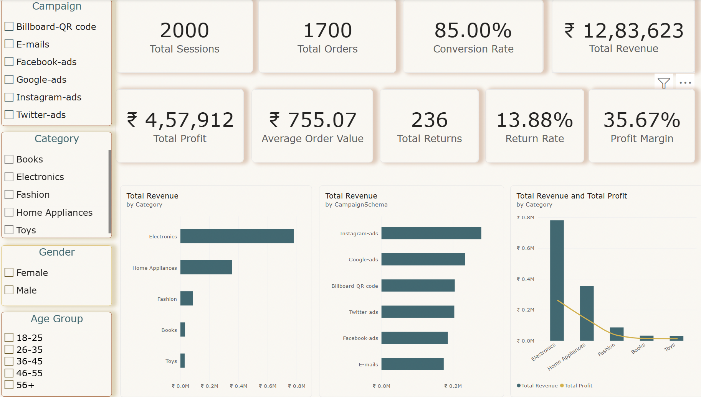
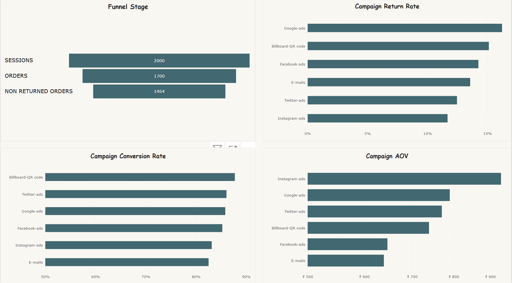
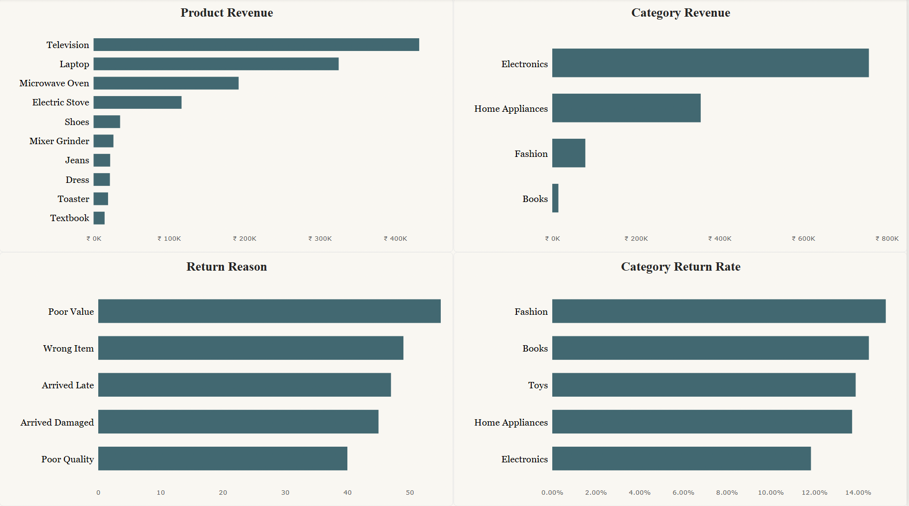

# E-Commerce Customer Funnel & Conversion Analysis

An end-to-end e-commerce analytics project using **Python, MySQL, and Power BI** to analyze customer funnel performance, marketing campaigns, product profitability, and return behaviour.

---

## 📌 Project Overview

This project analyzes **2,000 e-commerce customer sessions and 1,200 unique customers** to understand how users move through the purchase funnel and identify opportunities to improve conversion, revenue, profitability, and customer experience.

The analysis follows a complete data analyst workflow:

**Data Cleaning → Feature Engineering → EDA → SQL Analysis → Power BI Dashboard → Business Recommendations**

---

## 🎯 Business Questions

- What percentage of sessions convert into orders?
- Which marketing campaigns perform best?
- Which product categories generate the most revenue and profit?
- Which products are the biggest revenue drivers?
- Which customer age groups contribute the most value?
- What are the main reasons for product returns?
- Where are the biggest opportunities for improvement?

---

## 🛠️ Tools & Technologies

- **Python** — Pandas, NumPy, Matplotlib, Seaborn
- **SQL** — MySQL
- **Power BI** — Interactive dashboards & DAX
- **Git & GitHub** — Version control and project documentation

---

## 🔎 Project Workflow

### 1. Data Cleaning & Feature Engineering — Python

Performed data quality checks and created analytical features including:

- Conversion indicators
- Return indicators
- Revenue and profit
- Average Order Value
- Session duration
- Cart-to-order time
- Age groups
- Funnel metrics

### 2. Exploratory Data Analysis — Python

Analyzed:

- Overall funnel performance
- Campaign performance
- Category performance
- Product performance
- Return behavior
- Customer age segments

### 3. SQL Analysis — MySQL

Created business-focused SQL queries using:

- Aggregations
- `CASE` statements
- CTEs
- Window functions
- `RANK()`
- `LAG()`
- Conditional aggregation
- Revenue and profitability analysis

### 4. Power BI Dashboard

Built a 3-page interactive dashboard:

1. **Executive Overview**
3. **Funnel & Marketing**
4. **Products & Returns**

---

## 📊 Key Performance Indicators

| Metric | Result |
|---|---:|
| Sessions | 2,000 |
| Unique Customers | 1,200 |
| Orders | 1,700 |
| Conversion Rate | 85.00% |
| Revenue | ₹1,283,623 |
| Profit | ₹457,912 |
| Profit Margin | 35.67% |
| Average Order Value | ₹755.07 |
| Returns | 236 |
| Return Rate | 13.88% |

---

## 💡 Key Insights

### Marketing Performance

Instagram generated the highest revenue and Average Order Value, while Billboard-QR code recorded the highest conversion rate.

This demonstrates why marketing campaigns should be evaluated using multiple KPIs rather than conversion rate alone.

### Category Performance

Electronics was the strongest revenue-generating category, producing approximately **₹932K in revenue and ₹312K in profit**.

### Product Performance

Television and laptop were the highest-value products by revenue, highlighting the importance of high-ticket products to overall business performance.

### Returns

236 orders were returned.

The most common return reason was **Poor Value**, followed by **Wrong Item** and **Arrived Late**.

---

## 📈 Power BI Dashboard

### Executive Overview



### Funnel & Marketing



### Products & Returns



---

## 💼 Business Recommendations

- Prioritize campaigns based on **revenue, profit, AOV and conversion**, rather than conversion rate alone.
- Investigate the strong revenue contribution of the electronics category and maintain availability of high-value products.
- Investigate **Poor Value** returns through pricing, product positioning, and customer expectations.
- Analyze operational issues behind **Wrong Item** and **Arrived Late** returns.
- Monitor return rates alongside conversion when evaluating campaign and category performance.

---

## 📁 Repository Structure

```text
ecommerce-customer-funnel-analysis/
│
├── data/
│   └── Customer360Insights_cleaned.csv
│
├── images/
│   ├── executive_overview.png
│   ├── funnel_marketing.png
│   └── products_returns.png
│
├── notebooks/
│   └── Customer_Funnel_Analysis.ipynb
│
├── powerbi/
│   └── Customer_Funnel_Analysis.pbix
│
├── sql/
│   └── funnel_analysis.sql
│
├── README.md
└── .gitignore
